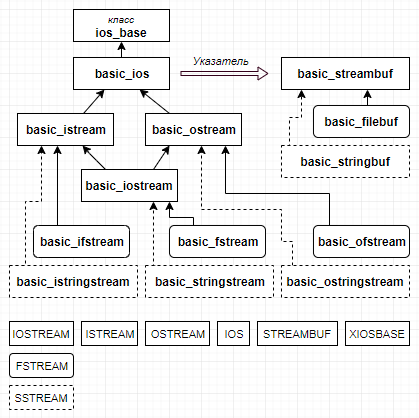

1) Иерархия классов  
  
- iostream: определены стандартные потоки cin, cout, wcin, wcout и т.д., включен файл istream;
- istream: определены шаблоны basic_istream и basic_iostream, включен заголовочный файл ostream;
- ostream: определен шаблон basic_ostream, включен заголовочный файл ios;
- ios: определен шаблон basic_ios, включен заголовочный файл xlocnum, а через него — streambuf;
- streambuf: определен шаблон basic_streambuf, включен заголовочный файл xiosbase;
- xiosbase: определен класс ios_base.
Видно, что всё организовано так, что для использования всех этих классов и шаблонов в программу достаточно включить заголовочный файл iostream.
- fstream: определены шаблоны basic_filebuf, basic_ifstream, basic_ofstream, basic_fstream.
- sstream: определены шаблоны basic_stringbuf, basic_istringstream, basic_ostringstream, basic_stringstream.  
